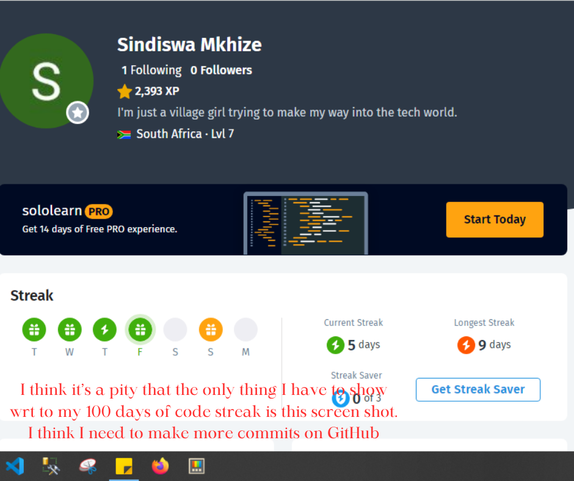

##23 February 2024 (005)
Even though I am posting every other day, it doesn't mean that I am only doing coding related things every other day. With nothing else to show I will now give you this shabby screenshot.

As I go through this challenge, I'd like to essentially commit to a language or framework - to sit down and focus on one thing but I keep getting distracted. I cannot justify my C interest. I even have a certificate to show for it.

Why? Just why? Anyway, I think that's it from me for now. (23 February 2024, 09:40)

## 21 February 2024 (day 003)
3 days ago I started SoloLearn's Coding Foundations and have completed the first 4 units 
- Getting Started with HTML
- Going Deeper with HTML
- Using Attributes
- Mastering HTML

## 19 February 2024 (day 001)
It's the 19th of February 2024 and I want to try again. My goals haven't really changed - I still just want to be a better web developer who dabbles in a little bit of mobile development via Flutter.

I don't know how I'm going to do it but this year I need to spend time sharpening my knowledge in these 3 topics:
- C#
- Flutter
- Angular

