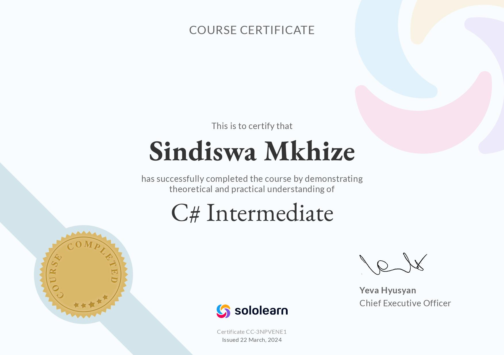
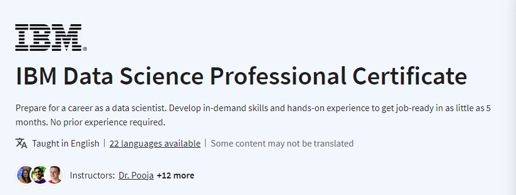

## 27 March 2024
It's 10:15 and Google, more specifically developers.google.com, is what's drawing my attention:

- [Learn Privacy](https://web.dev/learn/privacy?hl=en)
- [Associate Android Development](https://developers.google.com/certification/associate-android-developer)
- [Building Scalable Angular apps](https://developers.google.com/learn/pathways/maintainable-scalable-web-apps?hl=en)
- [Building cross-platform Angular apps](https://developers.google.com/learn/pathways/cross-platform-apps-with-angular?hl=en)

Hebana, the last I got a Google for Developers bagde was on the 14th of August 2023?! TSHINEKE!

It's 11:00 and my biggest takeaway from [Search Techniques for Web Developers](https://www.linkedin.com/learning/search-techniques-for-web-developers) is that I'm not using this journal well. Instead of using it to document my learning journey and practiced articulating what I have learnt - I am using it as a TO-DO list of sorts and a subpar tracker of my progress. Find attached below yet another certificate of progress, it turns out I really needed it since my "learn-to-be-a-better-programmer" goals are flawed. I can't really track my progress without points and certificates it seems. 🤦🤦

## 25 March 2024
How is it that I didn't get much done this long weekend? Procastination is a disease and I am apparently stage 4. Insert Michael Jordan saying "Stop it! Get Help" here.

Anyway, I think it's happening again. 

- [Learn HTML](https://www.learn-html.org/)
- [Learn Python](https://www.kaggle.com/learn/python)

Why am I creating new lists before completing everything else I saught out to do? ANGAZI. 😭😭😭

### Anyway, here's my real list for the week:

- [ ] Finish CISCO's Networking Academy's - Introduction to Data Science
- [ ] [LinkedIn Learning's - Python's Essential Training](https://www.linkedin.com/learning/python-essential-training-18764650)
- [ ] [LinkedIn Learning's - Learning C#](https://www.linkedin.com/learning/learning-c-sharp-8581491)
- [ ] [Foundational C# with Microsoft Learn](https://www.freecodecamp.org/learn/foundational-c-sharp-with-microsoft/)
- [ ] #Replit100DaysOfCode
- [ ] Complete [Coding for Data](https://www.sololearn.com/en/learn/courses/data-programming) and [Python Developer](https://www.sololearn.com/en/learn/courses/python-developer) courses on SoloLearn

## 22 March 2024
I think I am a fool and really need to reframe how I view long weekends and holidays. Instead of seeing them as time to grind I chilled a little too much. I still managed to work on this though so HOORAH!!

## 21 March 2024
It's almost 03:50 and I have not only saved my SoloLearn streak (32 days), my #100DaysOfReplitCode (13 days) streak and even Duolingo streak (113 days). Now I need to keep this groove for the rest of the day.

- Kaggle
- Course Careers
## 19 March 2024
Lately I've been leaning a lot towards DATA - hence this persistent Python phase. I have been told that Python is a verstile language that also holds some relevance in web development. To be honest I am still not sure ukuthi in which context but I am going to go ahead and believe that spending time seriously learning Python won't be time wasted.

I probably shouldn't be relying on one platform for this, but SoloLearn certificates have become sorta like Pokemon and I just gotta catch them all. These are the ones I am working on this week:

- [ ] [Python Developer](https://www.sololearn.com/en/learn/courses/python-developer)
- [ ] [Coding for Data](https://www.sololearn.com/en/learn/courses/data-programming)
- [ ] [C# Intermediate](https://www.sololearn.com/en/learn/courses/c-sharp-intermediate)

LinkedIn Learning TO-DO:
- [ ] [Becoming a Programmer: Foundations](https://www.linkedin.com/learning/paths/become-a-programmer-foundations) learning path
- [ ] [Python Essential Training](https://www.linkedin.com/learning/python-essential-training-18764650) course
- [ ] [Learning C#](https://www.linkedin.com/learning/learning-c-sharp-8581491) course

Oh, shnap. Why do I still watch series when there is just so much to do?
- [ ] [Foundational C# with Microsoft](https://www.freecodecamp.org/learn/foundational-c-sharp-with-microsoft/) with freeCodeCamp and Microsoft Learn
- [ ] I started a Dataquest [Junior Data Analyst](https://app.dataquest.io/learning/path/) course at the beginning of this month. I need to pick it up again!
- [ ] Whoosah! I need to live out Trey Kennedy's motto - DO LESS. GOD BLESS. My brain just thought [REMEMBER ME!](https://skillsforall.com/course/introduction-data-science?courseLang=en-US) - Wena, you didn't finish CICSO's Introduction to Data Science. Hebana! Focus. What is going to be? This or front end development? REALISTIC GOALS BABE! Make them realistic.

Here's a little FYI. Grid is doing a Coursera thing - when time allows, consider jumping on the band wagon.

Girl! Happy 30 days of consistency! Now you have 70 days to get your act together. All these plans, but no talk of CSS, HTML, TypeScript and Angular. Njani?! SQL and MongoDB wona? Actually I won't let you beat yourself up for this - imma breathe and trust the process. There has to be a method to this madness.

It took me a while, but I'm finally here...

## 18 March 2024
What day am I on? 29! Oh, my! I'm almost at 30. I want to toot my own horn for not breaking my streak but at the same time it must be said that I spent the weekend watching season 1 of Extraordinary Attorney Woo. Loadshedding was behaving, had network but I brewed in my existential crisis. This week I need to do better. I mean, my goodreads count is increasing but there are no new self-help or coding books. What a wow, that and LinkedInLearning progress is low. The ~16 hours it took a kdrama season could have been used for better pursuits.

## 15 March 2024
Days are tough. It's getting colder and there's all this talk about Devin. Should I keep on studying seriously or should I look into prompt engineering and data analysis? Sigh, I really need to shake off these doubts because I really won't be productive like this.

## 14 March 2024
I want to watch SpoonFedStudy's [YouTube video](https://www.youtube.com/watch?v=FC4jcrB4RHc) on repeat the entire day. I have been starting to feel like I am not making a dent in my studies and self-improvement journey and was tempted to quit because it seems pointless. The guy is making sense. I should focus on putting the best I can at any given moment, and realise that future me is relying on me. I need to work at making instant gratification lose it's shine, and do more things that add value to my life.

## 13 March 2024

09:30

It only took me 3 days :smile: - why did I avoid this course for the longest time? The fact that something is going to take a while doesn't mean that it will never be finished. I need to develop an attitude of grit, to persist even when progress doesn't seem so apparent. Right now my gauge for progress are these certificates - consistency, follow-through and hours spent on a subject or thing should be things I use more often. I need to believe that allocating time to studying WILL bring results.

## 12 March 2024
The [next certificate](https://www.sololearn.com/en/learn/courses/web-development) is proving to be a little difficult. I've barely made a dent in the course - LOOK:
  - [x] Getting Started with HTML
  - [x] Going Deeper with HTML
  - [x] Using Attributes - where I am starting today
  - [x] Mastering HTML
  - [x] Getting Started with CSS
  - [x] Styling Elements 
  - [x] Page Design and Layout - gonna start this at 10:00
  - [x] Transitions & Transforms 
  - [x] Welcome to JavaScript - It's 14:20 and I have one heart
  - [x] Going deeper with JavaScript
  - [ ] Working with Data - It's 16:08, I'm tired and have one heart again. Ngizoqedela ekhaya.
  - [ ] Control Flow

(This comment was made in the morning) Wait, kanti I am half-way there! That's actually good. :)
## 11 March 2024 (022)
Before I say what my plans for the week are perhaps I should quickly mention what I was up to during the weekend. Well, my laptop is dying and takes too long to start up so for the most part I did SoloLearn lessons using my phone. It paid off some-what...

Yesterday, the 10th of March 2024, I declared on [X](https://twitter.com/wandadrizzle/status/1766896181827785179) that these are my goals for the week:

 - To not break my #Replit100DaysOfCode and @sololearn streaks
 - Finish reading 'Make it Stick'
 - Do 3 @LeetCode problems (Python or C#)
 - Revise HTML and CSS (build something?)

The above is what I'll be working on.

SoloLearn courses that are "In Progress":
 - [ ] Web Development
 - [ ] Python Developer
 - [ ] C# Intermediate
 - [ ] Introduction to C++
 - [ ] Front-end for Beginners

Courses that I still want to add that do:
 - Coding for Data
 - C Intermediate
 - C++ Intermediate
 - SQL Intermediate

I think I am a little distracted. Why am I contemplating getting a Cybersecurity course just because I heard someone mention it?

16:05

I am out of SoloLearn hearts! ;( 
  - [x] Getting Started with HTML
  - [x] Going Deeper with HTML
  - [x] Using Attributes - where I am starting today
  - [x] Mastering HTML
  - [x] Getting Started with CSS
  - [ ] Styling Elements - hearts finished sengila
  - [ ] Page Design and Layout
  - [ ] Transitions & Transforms
  - [ ] Welcome to JavaScript
  - [ ] Going deeper with JavaScript
  - [ ] Working with Data
  - [ ] Control Flow
## 08 March 2024

Today's to-do list, made at 08:20
1. Read Make it Stick by Peter C. Brown (2. To Learn, Retrieve & 3. Mix Up Your Practice)
2. Finish SoloLearn's Web Development course
3. ~~Finish a LinkedIn Learning course - Programming Foundations: Real-World Examples~~

- Keeping track of SoloLearn progress: 
  - [x] Getting Started with HTML
  - [x] Going Deeper with HTML
  - [x] Using Attributes - where I am starting today
  - [ ] Mastering HTML
  - [ ] Getting Started with CSS
  - [ ] Styling Elements
  - [ ] Page Design and Layout
  - [ ] Transitions & Transforms
  - [ ] Welcome to JavaScript
  - [ ] Going deeper with JavaScript
  - [ ] Working with Data
  - [ ] Control Flow
- Keeping track of LinkedIn Learning progress:
  - [x] Intoduction
  - [x] 1. Functions
  - [x] 2. Objects
  - [x] 3. Class Inheritance
  - [x] 4. Modules and Packages
  - [x] 5. Lists and Tuples
  - [x] 6. Queues and Stacks
  - [x] 7. Sets - where I am starting today
  - [x] 8. Dictionaries
  - [x] 9. Conditional Execution
  - [x] 10. Loops
  - [x] 11. Error Handling
  - [x] 12. Polling and Event-Driven Programming
  - [x] Conclusion
- [Foundational C# with Microsoft](https://www.freecodecamp.org/learn/foundational-c-sharp-with-microsoft/) - I got distracted and decided to try and keep track of this too, I REALLY NEED to revisit this!
  - [x] Write Your First Code Using C#
  - [x] Create and Run Simple C# Console Applications
  - [ ] Add Logic to C# Console Applications - 6/8
  - [ ] Work with Variable Data in C# Console Applications
  - [ ] Create Methods in C# Console Applications
  - [ ] Debug C# Console Applications
  - [ ] Foundational C# with Microsoft Certification Exam
- The notes I made while doing the Web Development course are [HERE](https://replit.com/@sindiswasm072?path=folder/Web%20Development%20with%20SoloLearn).
- Other relevant resourses, podcasts and lessons viewed today:
  - [Are SPAs better than MPAs? | HTTP 203](https://www.youtube.com/watch?v=ivLhf3hq7eM)
 
It's 12 and only one of my 3 goals for the day is done. Am I working too slowly?

## 07 March 2024 (018)

Today's to-do list:

1. ~~Read Make it Stick by Peter C. Brown (Preface & 1. Learning is Misunderstood)~~
2. Start and finish SoloLearn's Web Development course
3. Do an hour's worth of a LinkedIn Learning course - Programming Foundations: Real-World Examples

Today feels like a quiet day, I have ensured to not break my SoloLearn streak but I am starting to doubt it as a learning tool. Anyway [today's reading](https://www.goodreads.com/user_status/show/801127169) was very enlightening. I plan to use the tricks they taugh as I go about learning Python, and the other languages that I MUST eventually revist.

>The good news is that we now know of simple and practical strategies that anybody can use, at any point in life, to learn better and remember longer: various forms of retrieval practice, such as low-stakes quizzing and self-testing, spacing out practice, interleaving the practice of different but related topics or skills, trying to solve a problem before being taught the solution, distilling the underlying principles or rules that differentiate types of problems, and so on.
## 06 March 2024 (017)
When the week started I said that my plans are not limited to the following, this is my progress as of the 6th of March 2024, 07:10.
This week's goals include, but are not limited to:
 - [ ] Finishing this LinkedIn learning path - [Become a Programmer: Foundations](https://www.linkedin.com/learning/paths/become-a-programmer-foundations), I am on the 2nd course. Which means nothing considering there are 13 in total. 
 - [x] Starting and completing SoloLearn's [Python Intermediate](https://www.sololearn.com/en/learn/courses/python-intermediate) course
 - [ ] Completing SoloLearn's [Web Development](https://www.sololearn.com/en/learn/courses/web-development?location=2) course, TBH I haven't touched it.

Am I distracted? Yes, knowing about so many resources is weird.
 - [HackerRank](https://www.hackerrank.com/dashboard)
 - [LeetCode](https://leetcode.com/explore/)
 - [codecademy](https://www.codecademy.com/)

It now seems like I can't avoid React even though when the year started I was set on just focusing on the Angular framework. My current python phase feels like a distraction. However, since I am set on doing this the hard-and-long way during this learning "sprint" I'll allow it - I can already see how helpful it will be when I finally make the time to do a data analytics course. Oh, as if I haven't been swayed enough from my web development goals - I saw an @dart_lang tweet talking about a [Google summer mentorship program](https://summerofcode.withgoogle.com/programs/2024/organizations/dart). That really made me miss Flutter. Maybe I should apply, the deadline is on the 2nd of April. Entlek, how does one apply? Do I read [this](https://github.com/dart-lang/sdk/wiki/Dart-GSoC-2024-Project-Ideas) and cold-call a potential mentor and say "Hey, I want to do the thing you proposed with you."? Ngathi impendulo [ila](https://summerofcode.withgoogle.com/). Anyway, this happened in the AMs.

It's 08:55 and I have realised something - by the end of the 100 days I'll be a markdown and GitHub aficionado. If you'd like to see a robot dancing CLICK [HERE](https://wandadrizzle.github.io/sololearn-tech-for-everyone/).

Should I?

It's 12:25 and there, done. This is wild but why don't the certificates use MY time zone?

I need to see how much of the learning path is left
- [x] 1. Programming Foundations: Fundamentals
- [x] 2. Programming Foundations: Beyond the Fundamentals
- [ ] 3. Programming Foundations: Real-World Examples
- [ ] 4. Programming Foundations: Object-Oriented Design
- [ ] 5. Programming Foundations: Algorithms
- [ ] 6. Programming Foundations: Data Structures
- [ ] 7. Programming Foundations: Design Patterns
- [ ] 8. Programming Foundations: Databases
- [ ] 9. Programming Foundations: Memory, Pointers, and Garbage Collection
- [ ] 10. Programming Foundations: APIs and Web Services
- [ ] 11. Programming Foundations: Secure Coding
- [ ] 12. Programming Foundations: Test-Driven Development
- [ ] 13. Programming Foundations: Software Testing/QA
## 05 March 2024 (016)
It's 10:15 and I finished the first 2 modules of SoloLearn's Python Intermediate. I really want to finish it so that I can officially rid myself of this Python itch. However, at the same time my LinkedIn course awaits. I need to finish [Programming Foundations: Fundamentals](https://www.linkedin.com/learning/programming-foundations-fundamentals-3) today!

It's 12:25 and after some lazing around I have finally finished it! You can find my notes and challenge attempts [HERE](https://replit.com/@sindiswasm072?path=folder/LinkedIn%20Learning%202024/LinkedIn%20Learning%20March%202024/Programming%20Foundations%20-%20Fundamentals)

It's 16:00 and I just finished SoloLearn's Intermediate course. Felt like I needed to finish it before spending time with Sasha Vodnik, the [Programming Foundations: Beyond Fundamentals](https://www.linkedin.com/learning/programming-foundations-beyond-the-fundamentals?contextUrn=urn%3Ali%3AlyndaLearningPath%3A56db2b643dd5596be4e4989b) instructor.

## 04 March 2024 (015?)
My SoloLearn streak is on 15, does this mean that I have been on my 100 day journey for 15 days or is there some discrepancy here? Anyway, I finished another SoloLearn course - as for why it wasn't web dev specific, well... that's because the person doing [the LinkedIn course I am currently doing](https://www.linkedin.com/learning/programming-foundations-fundamentals-3?contextUrn=urn%3Ali%3AlyndaLearningPath%3A56db2b643dd5596be4e4989b) decided to tech programming foundations using Python. 

This week's goals include, but are not limited to:
 - [ ] Finishing this LinkedIn learning path - [Become a Programmer: Foundations](https://www.linkedin.com/learning/paths/become-a-programmer-foundations)
 - [ ] Starting and completing SoloLearn's [Python Intermediate](https://www.sololearn.com/en/learn/courses/python-intermediate) course
 - [ ] Completing SoloLearn's [Web Development](https://www.sololearn.com/en/learn/courses/web-development?location=2) course
## 29 February 2024
So, I finished LinkedIn's **Starting Your Career in Tech: Software Development** learning path
  - [x] Course: Writing a Tech Resume
  - [x] Course: Tech Career Skills: Searching, Interviewing, and Landing a Job
  - [x] Course: Rock Your LinkedIn Profile
  - [x] Course: Tech Career Skills: Effective Technical Communication
  - [x] Course: Developer Career Paths and Certifications

Here's the evidence.

Today I started another learning path that is titled **Become a Programmer: Foundations**. Do I feel like I am doing things in a weird order? Yes. However, I also believe that these things MUST BE done! Another thing I'll definitely need to make time for is - learning how to learn. I am grateful for ChatGPT but I want to be a real developer that uses the internet for reference and NOT be stuck when the internet is down! 

## 28 February 2024 (010)
Here's the plan: 

- [ ] Start and finish Sololearn's [Web Development full learning path](https://www.sololearn.com/en/learn/courses/web-development?location=2)
  - [x] Getting Started with HTML
  - [ ] Going Deeper with HTML
  - [ ] Using Attributes
  - [ ] Mastering HTML
  - [ ] Getting Started with CSS
  - [ ] Styling Elements
  - [ ] Page Design and Layout
  - [ ] Transitions & Transforms
  - [ ] Welcome to JavaScript
  - [ ] Going Deeper with JavaScript
  - [ ] Working with Data
  - [ ] Control Flow
- [ ] Finish **Starting Your Career in Tech: Software Development**
  - [x] Course: Writing a Tech Resume
  - [ ] Course: Tech Career Skills: Searching, Interviewing, and Landing a Job
  - [ ] Course: Rock Your LinkedIn Profile
  - [ ] Course: Tech Career Skills: Effective Technical Communication
  - [ ] Course: Developer Career Paths and Certifications

## 27 February 2024 (009)
Getting a certificate with one's name on is nice. So, I worked on getting another. Here it is...

Now I just need to work on getting something with a little bit more significance and relevance. Something that will match and align with my web-developer goals. Doesn't LinkedIn Learning have something?

It is 15:45 and I am back to say that I found some things to go through in LinkedIn Learning
- [x] [**Introduction to Web Design and Development**](../../assets/pdf/COC-Introduction-to-Web-Design-and-Development.pdf)
- [ ] **Starting Your Career in Tech: Software Development**
  - [x] [Course: Getting Started with Technology: Think Like an Engineer](../../assets/pdf/COC-Getting-Started-with-Technology-Think-Like-an-Engineer.pdf)
  - [ ] Course: Writing a Tech Resume
  - [ ] Course: Tech Career Skills: Searching, Interviewing, and Landing a Job
  - [ ] Course: Rock Your LinkedIn Profile
  - [ ] Course: Tech Career Skills: Effective Technical Communication
  - [ ] Course: Developer Career Paths and Certifications

## 23 February 2024 (005)
Even though I am posting every other day, it doesn't mean that I am only doing coding related things every other day. With nothing else to show I will now give you this shabby screenshot.

As I go through this challenge, I'd like to essentially commit to a language or framework - to sit down and focus on one thing but I keep getting distracted. I cannot justify my C interest. I even have a certificate to show for it.

Why? Just why? Anyway, I think that's it from me for now. (23 February 2024, 09:40)

## 21 February 2024 (day 003)
3 days ago I started [SoloLearn's Coding Foundations](https://github.com/wandadrizzle/Coding-Foundations-SoloLearn) and have completed the first 4 units 
- Getting Started with HTML
- Going Deeper with HTML
- Using Attributes
- Mastering HTML

## 19 February 2024 (day 001)
It's the 19th of February 2024 and I want to try again. My goals haven't really changed - I still just want to be a better web developer who dabbles in a little bit of mobile development via Flutter.

I don't know how I'm going to do it but this year I need to spend time sharpening my knowledge in these 3 topics:
- C#
- Flutter
- Angular

