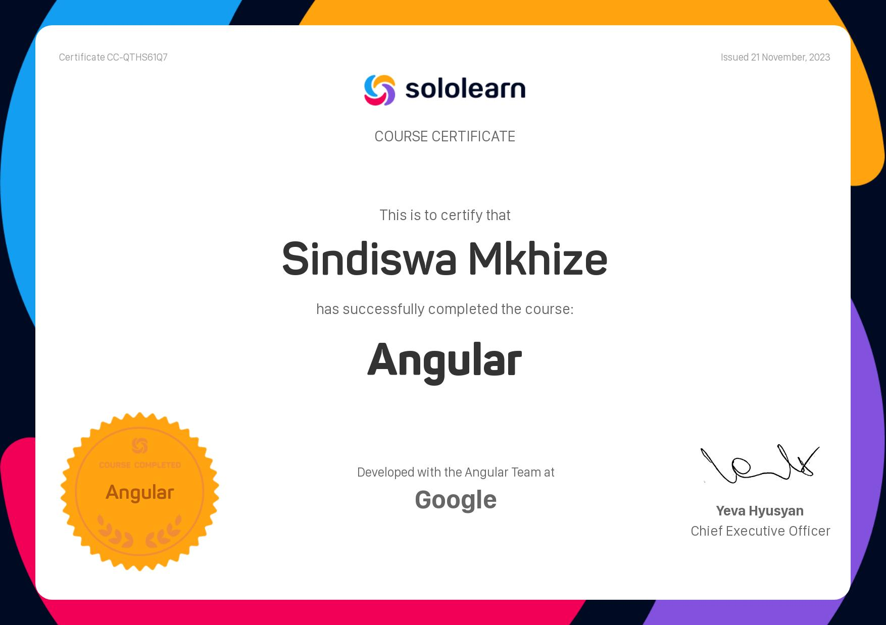

# Daily Coding Log - 20 November 2023 - DAY 008

## Today's Progress

- [ ] Finished module 3 of sololearn's Angular course.
- [ ] Started module 4 of sololearn's Angular course.
- [ ] Read through the first two lessons of The Odin Project's Foundations course.

## Thoughts

Well, I could have done more at night if I didn't have to work the night shift. 
Note to future self, breathe and commit to one resource child.

## Links

- [Link to project repository or relevant code files]
- https://www.theodinproject.com/paths/foundations/courses/foundations

## Plans for Tomorrow

FINISH THAT ANGULAR COURSE, THAT WAS A WEEKEND GOAL GIRL!

---
# Daily Coding Log - 21 November 2023 - DAY 009
## Today's Progress

- [ ] I finished sololearn's Angular course.

## Thoughts

I need to start using my commute times better. Should I not read or listing to coding podcasts, I need to immerse my mind with techniques and information on different technologies.
I finished my first course, I already want to revise some of the topics I studied. That'd be good idea, no?

PS: Here's my certificate as evidence.

